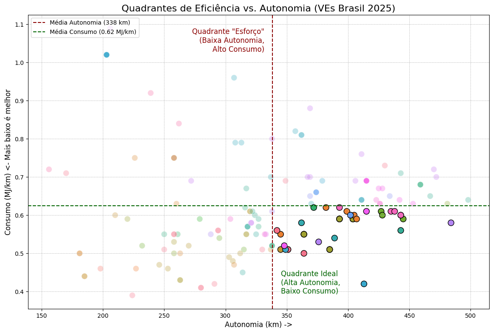
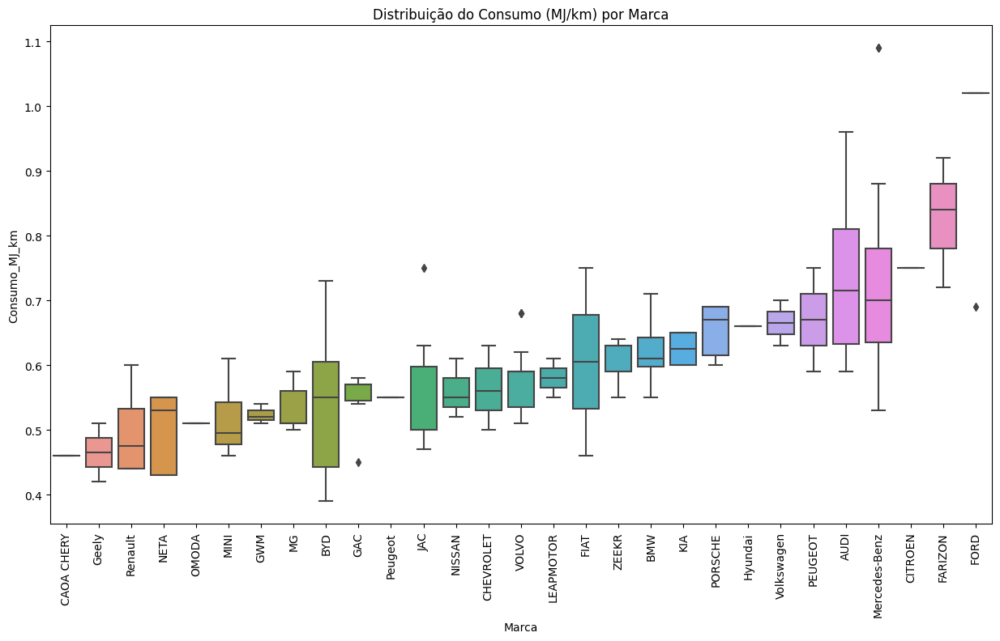

# Análise de Eficiência: Veículos Elétricos no Brasil (PBEV 2025)

Projeto de Análise Exploratória de Dados (EDA) focado em entender o panorama de eficiência e autonomia dos veículos elétricos (VEs) vendidos no Brasil, com base nos dados oficiais do INMETRO (PBEV 2025).

Este projeto demonstra o processo completo de Data Science (CRISP-DM): desde a extração e limpeza de dados brutos (de um PDF) até a análise e geração de insights.

---

### Visão Geral do Projeto

O objetivo foi responder a perguntas-chave sobre o mercado de VEs:
* Qual o "custo" da autonomia? Carros com maior alcance são menos eficientes?
* Quais marcas lideram em eficiência (baixo consumo) vs. autonomia?
* Qual o perfil médio (consumo e autonomia) de um VE no Brasil?

### Conteúdo do Repositório

1.  **[Notebook de Análise](https://www.kaggle.com/code/jadsonchagas/eda-pbev-2025-eficiencia-evs/)**
    * Este é o arquivo principal, contendo toda a análise, desde a limpeza até as visualizações e conclusões.

2.  **[Eficiência dos veículos elétricos no Brasil (PBEV-2025)](https://www.kaggle.com/datasets/jadsonchagas/eficincia-veculos-eltricos-brasil-pbev-2025)**
    * Link para o dataset limpo (CSV) que foi gerado para esta análise e publicado no Kaggle, sob a licença CC BY 4.0.

### Principais Insights

A análise revelou que o mercado não se divide apenas entre "eficiência" e "autonomia", mas que existe um terceiro grupo de elite:

| Quadrante Ideal | Consumo Por Marcas |
| :---: | :---: |
|  |  |

* **O "Quadrante Ideal":** Descobrimos 44 veículos (25% dos VEs) que são **melhores que a média em AMBAS as métricas** (autonomia > 338 km e consumo < 0.62 MJ/km).
* **Domínio do Equilíbrio:** Marcas como **Geely**, **MG** e **Volvo** se destacam neste quadrante, provando que é possível entregar alta autonomia sem sacrificar a eficiência.
* **Os Extremos:** Os demais veículos se dividem entre "Campeões Urbanos" (ex: BYD Dolphin Mini) e "Maratonistas de Luxo" (ex: BMW iX), onde há um claro trade-off.

### Ferramentas Utilizadas

* **Python**
* **Pandas:** Para limpeza e manipulação dos dados.
* **Matplotlib & Seaborn:** Para visualização de dados.
* **Jupyter Notebook:** Para a análise exploratória.

---

### Contato

* **Autor:** Jadson Chagas
* **LinkedIn:** [https://www.linkedin.com/in/jadson-chagas/](https://www.linkedin.com/in/jadson-chagas/)
* **GitHub:** [https://github.com/jeppa1](https://github.com/jeppa1)
